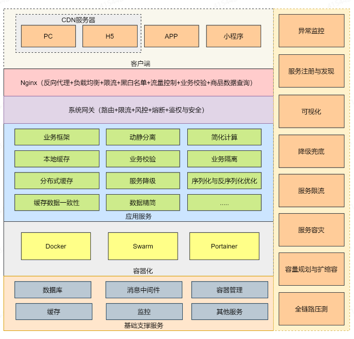

# Seckill秒杀系统

## 为什么要搞秒杀系统

- **高并发、大流量场景**下最具代表性的系统。
- 秒杀系统背后涉及到的**高并发、高性能、高可用、可扩展的技术思路和架构模式与架构思想**，可以直接复用于任何需要支撑高并发、大流量的业务场景。

## 秒杀系统核心技术

单就秒杀系统本身而言，就是为应对**瞬时高并发、大流量场景**而设计的支持**高并发、大流量**的系统，其背后会涉及到众多**高并发、高性能、高可用**的技术作为基础保障。同时，在系统中，也要重点突破**库存与限购、防刷与风控、数据一致、热点隔离、动静分离、削峰填谷、数据兜底、限流与降级、流控与容灾**等核心技术问题。

## 方案目标

- 业务目标：满足用户故事中的各类场景。
- 技术目标：秒杀商品详情页接口：10W+QPS，秒杀接口：1W+TPS。
- 架构目标：高并发、高性能、高可用、可监控、可预警、可伸缩。

## 技术选型

- 开发框架：SpringBoot。
- 缓存：Redis+本地缓存。
- 数据库：MySQL。
- 业务网关：SpringCloud Gateway。
- 持久层框架：MyBatis。
- 服务配置与注册发现：Nacos。
- 容器：Docker。
- 容器化管理：Swarm、Portainer。
- 监控：Prometheus、Grafana。
- 系统限流： Nginx+Lua、Sentinel。
- 消息中间件： RocketMQ。
- 单元测试：Junit。
- 压测工具：JMeter。

## 秒杀系统总体架构设计
